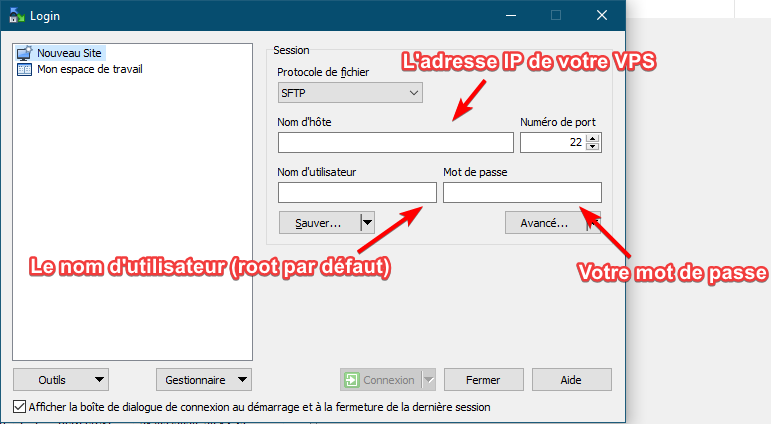
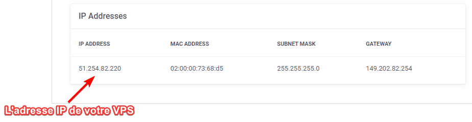
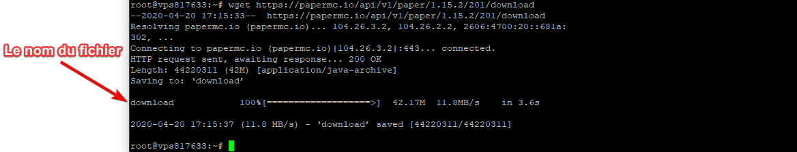

# Comment installer un serveur Minecraft sur son VPS.

### 1. Mettre à Jour et installer les dépendances

Pour commencer, nous allons vérifier que notre VPS est à jour avec cette commande :
`apt-get update; apt-get full-upgrade -y` : Pour vérifier les mises à jour.

Une fois ces commandes passées très rapidement ⚡, nous allons pouvoir installer Java.

**Attention, cette commande ou ce nom de paquet ne peut être valable sur certains systèmes d'exploitation comme Debian 10. Il faudra effectuer des recherches supplémentaires sur comment l'installer sur votre système incompatible.** Pour ma part j'utilise Ubuntu 18.04, je vous le conseille car il est extrêmement compatible avec la plupart des logiciels de l'heure d'aujourd'hui.
Ducoup, pour installer Java 8 JDK, il suffit exécuter cette commande :

`apt-get install openjdk-8-jdk wget screen -y`

Si la commande ne fonctionne pas essayez celle-ci :
```
apt install -y wget gnupg software-properties-common sudo
wget -qO - https://adoptopenjdk.jfrog.io/adoptopenjdk/api/gpg/key/public | sudo apt-key add -
sudo add-apt-repository --yes https://adoptopenjdk.jfrog.io/adoptopenjdk/deb/
apt install adoptopenjdk-8-hotspot -y
```
Et c'est bon ! Si vous n'avez eu aucune erreur et que plein de lignes ont défilées, notre Java est prêt à l'utilisation.

### 2. Télécharger la bonne version de Minecraft

Bon,
Maintenant le choix risque d'être très difficile... Il va falloir savoir quelle version on a besoin. J'ai donc décidé de vous faire un petit tableau récapitulatif de plusieurs versions connues et modifiées de serveur Minecraft afin de vous orienter au mieux.

|                                                              | Performances | Compatibilité | Mods | Plugins | Version         |
| ------------------------------------------------------------ | ------------ | ------------- | ---- | ------- | --------------- |
| [PaperSpigot](https://papermc.io/) \| [Mirror](https://yivesmirror.com/downloads/paper) | ✅            | ✳️             | ❌    | ✅       | 1.15.x - 1.7.10 |
| [Spigot](https://getbukkit.org/download/spigot)              | ⚠️            | ✅             | ❌    | ✅       | 1.15.x - 1.4.x  |
| [CraftBukkit](https://getbukkit.org/download/craftbukkit)    | ⚠️            | ⚠️             | ❌    | ⚠️       | 1.15.x - 1.0.0  |
| [CatServer](https://github.com/Luohuayu/CatServer/releases)  | ✅            | ✳️             | ✅    | ✳️       | 1.12.2          |
| Thermos [Fichier1](https://github.com/CyberdyneCC/Thermos/releases/download/58/Thermos-1.7.10-1614-server.jar) [Fichier2](https://github.com/CyberdyneCC/Thermos/releases/download/58/libraries.zip) | ✅            | ✳️             | ✅    | ✅       | 1.7.10          |
| [SpongeForge](https://www.spongepowered.org/downloads/spongeforge/stable/) | ✅            | ❌             | ✅    | ⚠️       | 1.12.2 - 1.10.2 |
| [Forge](http://files.minecraftforge.net/)                    | ⚠️            | ✅             | ✅    | ❌       | 1.15.2 - 1.1    |
| [Cuberite](https://cuberite.org/)                            | ✅            | ❌             | ❌    | ❌       | 1.12.2 - 1.8    |
| [Glowstone](https://glowstone.net/)                          | ✅            | ✅             | ❌    | ✅       | 1.12.2          |

Une fois que vous aurez choisi quelle version utilisée (Contribuez les connaisseurs :p), nous allons la télécharger sur notre VPS.

Pour ceci nous avons 2 solutions :

###### - Utiliser un client SFTP et uploader manuellement sur notre serveur.

Ici, nous allons utiliser une technique que je ne vous recommande pas du tout mais qui est quand même utile à savoir.
Mais d'abord mettons les choses au clair : N'utilisez plus FileZilla, il est gentil et facile, mais WinSCP c'est le meilleur.
Donc téléchargez TOUT DE SUITE [WinSCP](https://winscp.net/eng/download.php). Voila, maintenant on va pouvoir continuer dans de bonnes conditions.

Remplissez les cases comme décrites ci-dessous dans WinSCP puis cliquez sur "Connexion"





Une fois connecté, il vous suffira de créer un nouveau dossier, aller dans celui-ci, glisser déposer le fichier du serveur Minecraft en question et de renommer avec un clic droit en `server.jar`.

C'est bon on peut passer à la suite !

###### - Directement télécharger en ligne de commande le fichier

Ici, nous allons utiliser `wget` : 

Donc, vous allez maintenant vous rendre sur le site du serveur Minecraft que vous avez choisi et copier le lien pour télécharger le fichier du serveur (2 si nécessaire). Normalement,  quand vous collez le lien dans la barre d'URL de votre navigateur internet le téléchargement du fichier devrait se télécharger : Cela veut dire que notre fichier est valide. Sinon essayez la méthode ci-dessus.

Créons un dossier pour notre serveur Minecraft avec la commande :
`mkdir LeNomDeMonServeurMinecraft`
Puis rendons-nous dans celui-ci avec cette commande :
`cd LeNomDeMonDossierCrééPrécédemment`

Et enfin téléchargeons notre serveur avec la commande suivante :
`wget  <l'urldufichierduserveurminecraft>`

Si une petite barre avec des flèche avance, le fichier devrait être téléchargé. Le nom du fichier devrait être affiché juste ici : 



Pour être sûr que tout est prêt et pour ne pas se tromper dans le futur, nous allons renommer notre fichier server.jar

Et c'est bon ! Nous allons maintenant pouvoir lancer notre serveur Minecraft 😋.

### 3. Lancer notre serveur Minecraft

Nous voici dans la dernière ligne droite : Celle de démarrer notre serveur et le laisser allumé.
Premièrement, afin de le laisser allumer une fois que nous serons déconnecté de notre console SSH, il va falloir utiliser la commande screen.

Donc, créons un screen avec un joli nom afin de pouvoir facilement le reconnaitre : 
`screen -d -m -S <NomDeMonScreen>`
Puis rendons-nous à l'intérieur de celui-ci avec cette commande (à retenir) :
`screen -x <LeNomDeMonScreen>`

Nous voici maintenant dans le screen de notre serveur Minecraft. Toutes les commandes que nous allons exécuter juste ici seront en ligne jusqu'à l'arrêt de la machine.

Créons un fichier start.sh dans lequel nous allons mettre la commande de lancement pour notre serveur avec quelques arguments pour le boost.

`nano start.sh`

Puis collez (avec un clic droit) ceci à l'intérieur :

```
java -Xms512M -Xmx10G -XX:+UseG1GC -XX:+ParallelRefProcEnabled  -XX:MaxGCPauseMillis=200 -XX:+UnlockExperimentalVMOptions  -XX:+DisableExplicitGC -XX:-OmitStackTraceInFastThrow  -XX:+AlwaysPreTouch -XX:G1NewSizePercent=30 -XX:G1MaxNewSizePercent=40  -XX:G1HeapRegionSize=8M -XX:G1ReservePercent=20 -XX:G1HeapWastePercent=5 -XX:G1MixedGCCountTarget=8 -XX:InitiatingHeapOccupancyPercent=15  -XX:G1MixedGCLiveThresholdPercent=90  -XX:G1RSetUpdatingPauseTimePercent=5 -XX:SurvivorRatio=32  -XX:MaxTenuringThreshold=1 -Dusing.aikars.flags=true  -Daikars.new.flags=true -jar server.jar nogui
```

Notez quand même que vous devez modifier le `-Xmx10G` par le nombre de mémoire RAM que vous souhaitez lui allouer (1go = `-Xmx1G`, 2go = `-Xmx2G`, ...)

Une fois ceci fait vous pouvez faire **CTRL** + **X** puis **Y** et enfin **ENTRÉE**
Et faites la commande `chmod +x start.sh` afin de donner la permission d'exécuter ce fichier.

Quand vous ferez le commande `./start.sh`, notre script s'exécutera et lancera notre serveur Minecraft, hors au premier lancement il faut bien évidemment accepter l'EULA de Minecraft. Afin de ne pas vous embêter à vous reconnecter en SFTP, nous allons le modifier directement en SSH grâce à la commande 
`nano eula.txt`.
Une fois dans le fichier, il vous suffira de modifier le `eula=false` en `eula=true` puis de refaire 
**CTRL** + **X** puis **Y** et enfin **ENTRÉE**.

C'est bon ! Si vous faites la commande `./start.sh`, votre serveur se lance comme par magie !
Maintenant, sortons de notre screen afin de vaquer à d'autre occupations en faisant

**CTRL** + **A** puis **D** et enfin **ENTRÉE**.

Et 💨 on est sortis de notre serveur. Notez quand même (je vous le rappelle) que pour retourner à l'intérieur de celui-ci il faut faire la commande

`screen -x <LeNomDeMonScreen>`

D'ailleurs seconde info, si votre serveur se met à crasher *car vous n'avez pas choisit la bonne version de serveur* il vous suffit de faire CTRL + C afin de le tuer (n'utilisez pas ça tout les jours c'est pas foufou).

Voila.


Crédits :

[@MichelBaie - Creeper](https://github.com/MichelBaie/): Rédacteur de tuto.
