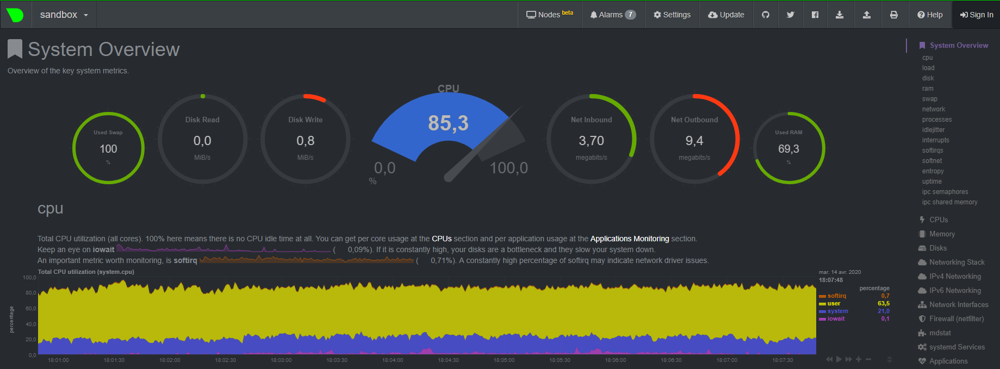
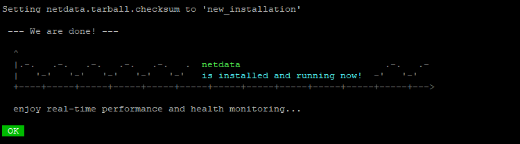

# Netdata : Outils de monitoring simple et Opensource.

## Qu'est-ce qu'est Netdata ?

Netdata et un outils de monitoring Opensource et simple à installer qui vous aidera à monitorer votre serveur.

## Images & Demo

Voici un lien de démo si vous voulez essayer : https://london.my-netdata.io

## Installation

Pour l'installer c'est très simple, il suffit de faire la commande suivante : 

``bash <(curl -Ss https://my-netdata.io/kickstart.sh)``

Quand vous aurez le message "Press ENTER to build and install netdata to your system" appuyez sur entrer.

Quand l'installation sera terminée vous aurez ce message :

Vous pourrez désormais accéder à votre netdata via votre navigateur à l'IP de votre VPS sur le port 19999.

Exemple : http://123.256.789.012:19999
