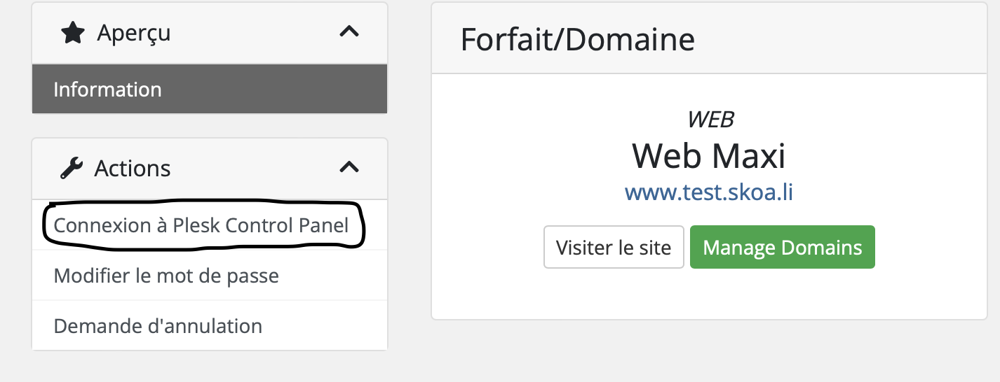
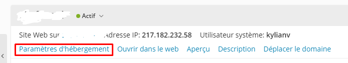
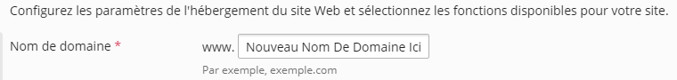

# Changer le nom de domaine sur Plesk

:one: accédez à plesk via [l'espace de gestion](https://gestion.skoali.fr) de Skoali 

:two: cliquez sur le bouton nommé "Connexion à Plesk Control Panel" 

:three: cliquez sur le bouton "Paramètres d'hébergement" 

:four: à droite du texte "Nom De Domaine" après le www. entrez le nouveau nom de domaine 

:five: En bas de la page cliquez sur le bouton APPLIQUER et OK pour que l'opération soit prise en compte

:warning: Si vous souhaitez mettre un nom de domaine en `.skoa.li` il suffit simplement de mettre `votreDomaine.skoa.li` à la place du nom de domaine custom, si vous souhaitez entrer votre propre nom de domaine que vous aurez acheté au préalable il suffit simplement de modifier les Nameserv en `ns1.skoali.fr` et `ns2.skoali.fr` 

**__En cas de problème je reste disponible sur discord : @Skyfr#3258__**

