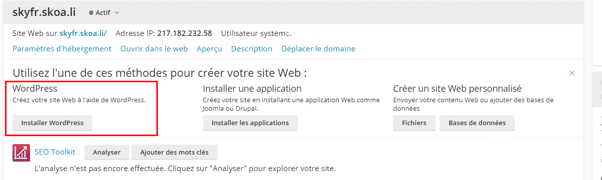
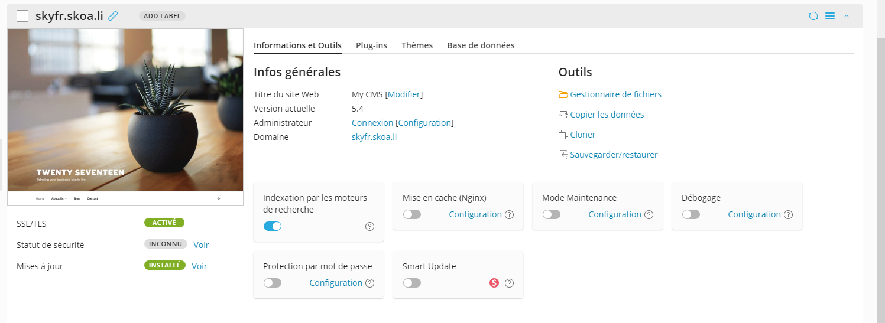

# Comment installer WordPress sur un web Skoali

1. Connectez vous à votre compte sur l'espace de gestion de Skoali

:information_source: Si vous ne savez pas vous connecter a l'espace de gestion des service WEB je vous redirige vers un autre tutoriel nommé : "Comment se connecter à plesk"

2. Après être connecté vous avez deux choix pour installer votre site WordPress

:a: Si vous avez cette page vous pouvez cliquer sur le bouton Installer WordPress 

:b: Si vous n'avez pas la page en dessus vous pouvez cliquer sur "Applications" puis WordPress

3. Après vous pouvez configurer toutes les données il est fortement conseillé de ne pas modifier le mot de passe de la base de données après cela vous pouvez lancer l'installation de WordPress

4. Après ça vous accéderais sur une page ressemblant à ça 

5. Vous pouvez donc cliquer sur le bouton Connexion qui se situe à coté de "Administration"

:tada: Voici pour l'installation de WordPress sur votre site hébergé par skoali, en cas de problème vous pouvez venir sur le discord de skoali ou bien me contacter via mp sur Discord  (@Skyfr#3258 )